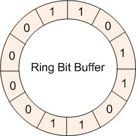
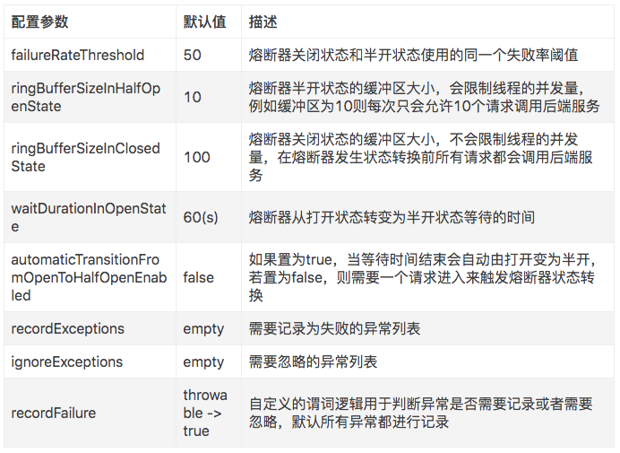

# Resilience4j - 轻量级熔断框架

- <https://www.jianshu.com/p/5531b66b777a>

The example uses for SpringBoot1, here upgrade to SpringBoot2

## 简介

Resilience4j是一款轻量级，易于使用的容错库，其灵感来自于Netflix Hystrix，但是专为Java 8和函数式编程而设计。轻量级，因为库只使用了Vavr，它没有任何其他外部依赖下。相比之下，Netflix Hystrix对Archaius具有编译依赖性，Archaius具有更多的外部库依赖性，例如Guava和Apache Commons Configuration。

要使用Resilience4j，不需要引入所有依赖，只需要选择你需要的。

Resilience4j提供了以下的核心模块和拓展模块:

核心模块：

- resilience4j-circuitbreaker: Circuit breaking
- resilience4j-ratelimiter: Rate limiting
- resilience4j-bulkhead: Bulkheading
- resilience4j-retry: Automatic retrying (sync and async)
- resilience4j-cache: Result caching
- resilience4j-timelimiter: Timeout handling

## Circuit Breaker

### 简介

CircuitBreaker通过具有三种正常状态的有限状态机实现：CLOSED，OPEN和HALF_OPEN以及两个特殊状态DISABLED和FORCED_OPEN。当熔断器关闭时，所有的请求都会通过熔断器。如果失败率超过设定的阈值，熔断器就会从关闭状态转换到打开状态，这时所有的请求都会被拒绝。当经过一段时间后，熔断器会从打开状态转换到半开状态，这时仅有一定数量的请求会被放入，并重新计算失败率，如果失败率超过阈值，则变为打开状态，如果失败率低于阈值，则变为关闭状态。


Resilience4j记录请求状态的数据结构和Hystrix不同，Hystrix是使用滑动窗口来进行存储的，而Resilience4j采用的是Ring Bit Buffer(环形缓冲区)。Ring Bit Buffer在内部使用BitSet这样的数据结构来进行存储，BitSet的结构如下图所示：



每一次请求的成功或失败状态只占用一个bit位，与boolean数组相比更节省内存。BitSet使用long[]数组来存储这些数据，意味着16个值(64bit)的数组可以存储1024个调用状态。

计算失败率需要填满环形缓冲区。例如，如果环形缓冲区的大小为10，则必须至少请求满10次，才会进行故障率的计算，如果仅仅请求了9次，即使9个请求都失败，熔断器也不会打开。但是CLOSE状态下的缓冲区大小设置为10并不意味着只会进入10个 请求，在熔断器打开之前的所有请求都会被放入。

当故障率高于设定的阈值时，熔断器状态会从由CLOSE变为OPEN。这时所有的请求都会抛出CallNotPermittedException异常。当经过一段时间后，熔断器的状态会从OPEN变为HALF_OPEN，HALF_OPEN状态下同样会有一个Ring Bit Buffer，用来计算HALF_OPEN状态下的故障率，如果高于配置的阈值，会转换为OPEN，低于阈值则装换为CLOSE。与CLOSE状态下的缓冲区不同的地方在于，HALF_OPEN状态下的缓冲区大小会限制请求数，只有缓冲区大小的请求数会被放入。

除此以外，熔断器还会有两种特殊状态：DISABLED（始终允许访问）和FORCED_OPEN（始终拒绝访问）。这两个状态不会生成熔断器事件（除状态装换外），并且不会记录事件的成功或者失败。退出这两个状态的唯一方法是触发状态转换或者重置熔断器。

熔断器关于线程安全的保证措施有以下几个部分：

- 熔断器的状态使用AtomicReference保存的
- 更新熔断器状态是通过无状态的函数或者原子操作进行的
- 更新事件的状态用synchronized关键字保护
- 意味着同一时间只有一个线程能够修改熔断器状态或者记录事件的状态。

### 可配置参数



# Java development environment

`sdk list java && sdk current java`

# Setup Maven wrapper

- https://github.com/takari/maven-wrapper

`mvn -N io.takari:maven:0.7.7:wrapper -Dmaven=3.5.4`

# Script step by step

```bash
./mvnw clean spring-boot:run
```

# One stop script

```bash
/bin/bash run.sh
/bin/bash run-test.sh
/bin/bash run-stop.sh
```
